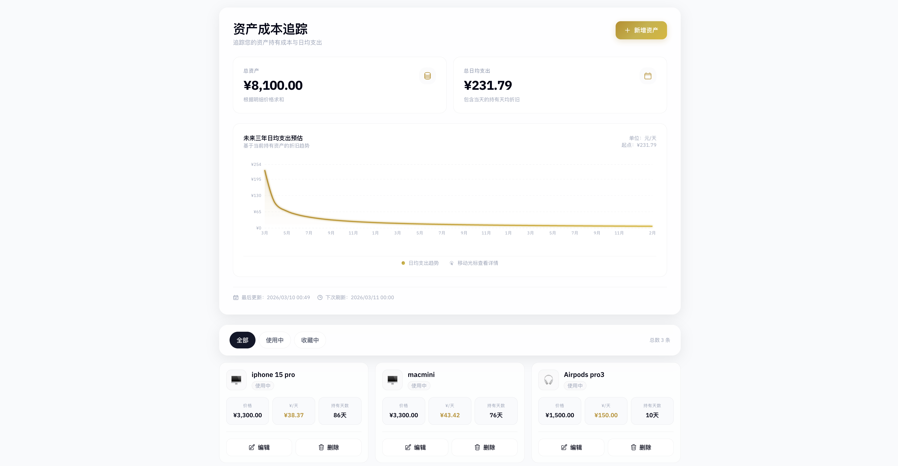
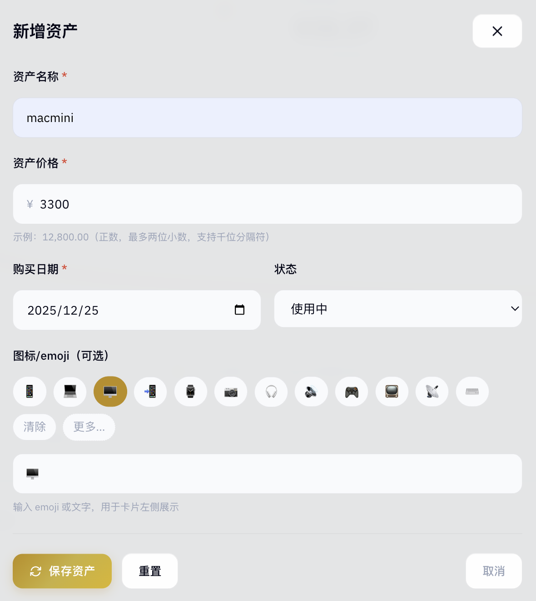

<div align="center">
  <h1>Asset Cost Tracker</h1>
  <p>一个纯前端、local-first 的资产成本追踪工具</p>
  <p>
    
    
    
    
    
  </p>
</div>

输入购买价格和购买日期后，应用会自动计算每项资产已经持有了多少天、平均每天摊销了多少成本，并汇总出当前总资产与总日均支出。数据默认保存在浏览器本地，不依赖后端服务，也不会因为刷新页面而丢失。

## 界面预览

### 仪表盘总览

<p align="center">
  
</p>

首页会同时展示总资产、总日均支出、未来三年日均支出趋势，以及每项资产的价格、持有天数和日均成本。

### 录入体验

<p align="center">
  
</p>

录入表单支持名称、价格、购买日期、状态和图标，包含价格与日期校验，适合快速录入日常设备、家电或收藏品。

## 核心能力

- 记录资产名称、价格、购买日期、状态和图标。
- 自动计算每项资产的持有天数与日均成本（`¥/天`）。
- 汇总展示总资产和总日均支出。
- 支持按 `全部`、`使用中`、`收藏中` 筛选。
- 支持新增、编辑、删除资产。
- 提供未来 36 个月日均支出趋势图，方便观察摊销变化。
- 使用 `localStorage` 持久化资产数据。
- 跨过本地午夜后自动刷新，确保计算结果不会停留在前一天。

## 适合什么场景

- 追踪数码设备、摄影器材、家电、家具等耐用品的使用成本。
- 管理个人收藏或家庭资产的买入价格和持有时间。
- 快速回答“这个东西我现在平均每天花了多少钱”。

## 快速开始

### 环境要求

- Node.js 20+
- npm 10+

### 安装与运行

```bash
npm install
npm run dev
```

默认开发地址通常是 [http://localhost:5173](http://localhost:5173)。

### 构建生产版本

```bash
npm run build
npm run preview
```

## 使用方式

1. 点击页面右上角的“新增资产”。
2. 输入资产名称、价格和购买日期。
3. 可选填写状态和图标，让卡片更容易区分。
4. 保存后即可查看总资产、总日均支出、单项 `¥/天` 与持有天数。
5. 随着时间推移，应用会在本地午夜后自动刷新计算结果。

## 核心计算规则

项目严格按照下面的公式计算：

```text
daysHeld_i = max(1, diffDays(today, purchaseDate_i) + 1)
dailyCost_i = price_i / daysHeld_i
totalCost = sum(price_i)
totalDailyAvg = sum(dailyCost_i)
```

说明：

- 购买当天记为第 1 天。
- 今天也会计入持有天数。
- `dailyCost` 内部按高精度计算，展示时保留两位小数。
- 为避免除以 0，持有天数最少为 1。

## 数据存储与隐私

- 所有数据都保存在当前浏览器的 `localStorage` 中。
- 当前存储键为 `assetManager_v1`。
- 项目不要求登录，也不依赖云端数据库。
- 清除浏览器本地数据后，资产记录也会被清除。

## 技术栈

- React 19
- TypeScript
- Vite
- Recharts
- localStorage

## 开发脚本

```bash
npm run dev      # 启动开发服务器
npm run build    # TypeScript 检查并构建
npm run preview  # 预览生产构建
npm run lint     # 运行 ESLint
```

## 开源协议

本项目基于 [MIT License](./LICENSE) 开源。
